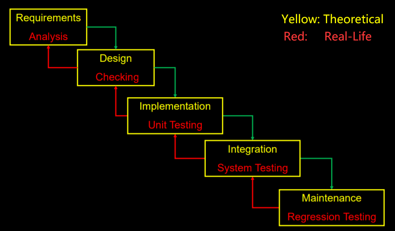

### SCM (Software Configuration Management)

##### 1. Four aspects of SCM

- Change control
- Version control
- Building
- Releasing

##### 2. Version Control System

- SVN
  - Directory Layout: **Trunk**, **Branches**, **Tags**
  - **Central repository**

- Git

  - File Lifecycle & Three Areas: 

    <center class="half"></center>

  - **Distributed repository**

  - **Use checksums**

  - **Takes snapshots**

  - **Greater redundancy and speed**

##### 3. Advantage and Disadvantage of Branching

- **Advantage**
  - Increase productivity by allowing parallel development
  - reduce risk by isolating experimental changes from breaking the mainline
- **Disadvantage**
  - create customized version for a different customer


### Extreme Programming (XP)

##### 1. Waterfall model (Used in traditional development)



##### 2. Main ideas (Iterative process)

- **Don't write much document, code and tests are the main written product**
- Implement features one by one
- Release code frequently
- Work closely with the customer
- Communicate a lot with team members

##### 3. Some Key Practices

- **Planning game** for requirements
- **Test-driven development** for design and testing
- **Refactoring** for design
- **Pair programming** for development
- **Continuous integration** for integration
- **On site customer**

##### 4. Concept

- **User story**: Customer writes user stories, programmers estimate time to do each story
- **Story point**: unit of measure for expressing the overall size of a user story
- **Ideal time**: the amount of time "something" takes when stripped of all peripheral activities
- **Elapsed time**: the amount of time that passes on the clock to do "something"
- **Velocity**: measure of a team's rate of progress

##### 5. Difference between Waterfall and XP

- Waterfall model doesn't have iteration, and XP's iteration is short
- Waterfall model needs relatively independent work, and XP is a collaborative work

##### 6. Steps in Test Driven Development (TDD)


##### 7. Advantages and Disadvantage of Test-driven

- **Advantage**
  - Simpler/better quality design or code
  - Easier refactoring
  - Detect defects earlier and you can correct them more easily
  - Help developer to locate the bugs immediately
- **Disadvantage**
  - Less flexible
  - Design changes later may render tests unusable
  - No code to test in the beginning


### Testing

##### 1. Failure & Error & Fault

- failure: termination of the ability of an element to perform a function as required
- error: difference between a computed value and the true value
- fault: a requirements, design or implementation deviation from a desired state
  - many failures can be caused by a fault
  - failures help localize or find faults

##### 2. Better Test

- Each test should be independent of each other
- Any given behavior should be specified in one and only one test
-  Correct method signature should be `assertEquals (expected, actual)`

##### 3. Code Coverage

- measured used to describe the degree to which the source code of a program is executed when a particular test suite runs
- **White box testing**
- Criteria
  - Instructions Coverage
  - Statements Coverage
  - Branch Coverage
  - Method Coverage
  - Class Coverage

- Computing Coverage
  $$
  Statement\ Coverage = \frac{Number\ of\ Executed\ Statements}{Total\ Number\ of\ Statements}\times100
  $$

$$
Branch\ Coverage = \frac{Number\ of\ Executed\ Branches}{Total\ Number\ of\ Branches}\times100
$$

##### 4. Testing Type

- **Unit Testing**: Test individual units of a software
- **Integration Testing**: Verify software quality by testing two or more dependent software modules as a group
- **Regression Testing**: Testing that are performed to ensure that changes made does not breaking existing functionality
- **Smoke Testing**: A quick set of tests run on the daily build to check whether code catches fire or "smoke" (break)
- **Flaky Testing**: Test which could fail or pass for the same code
  - Smoke test should be automated
  - Smoke test are a kind of regression test
  - Smoke test should run fast

##### 5. JUnit Testing Template (Unit Testing & Integration Testing & NOT System Testing)

```java
@Test
public void TEST() {
    assertEquals(expected, actual);
    assertTrue(actual);
    assertFalse(actual);
    assertNull(actual);
}
```

##### 6. Manual Testing & Automated Testing

- **Manual Testing is appropriate when**
  - Test need to be run once
  - Tester does.'t know how to program
  - Writing some kinds of GUI test
- **Automated Testing is appropriate when**
  - Test need to be run over and over as the software is changed
  - When we want to use them as documentation


### Metrics

##### 1. Cyclomatic Complexity

- **Number of branches (if, while, for) + 1**
- Number of predicates + 1
- Number of edges -  Number of nodes + 2
- Number of regions of the flow graph

##### 2. Coupling and Cohesion

- **Coupling**: dependences among modules
- **Cohesion**: dependences within modules
- High Coupling is bad
  - makes designs hard to change
  - makes classes hard to reuse
  - makes classes hard to test

##### 3. Martin's Coupling Metric

- **Ca (Afferent coupling)**: the number of classes outside this module that depend on classes inside this module

- **Ce (Efferent coupling)**: the number of classes inside this module that depend on classes outside this module

- **Instability**: close to 0 means it is stable and hard to change
  $$
  Instability = \frac{Ce}{Ca+Ce}
  $$

- **Abstractness**: close to 0 means it is concrete and hard to extend
  $$
  A = \frac{T_{abstract}}{T_{abstract}+T_{concrete}}
  $$

##### 4. List of Metrics

- **Weighted Methods Per Class (WMC)**: the sum of the complexities of the methods in the class

  High WMC indicate a more complex code

- **Depth of Inheritance Tree (DIT)**: Maximum length from a class to the root of the tree

  High DIT indicate a more complex the project

- **Number of Children (NOC)**: Number of immediate subclasses

  High NOC indicate high reuse

- **Coupling between Object  Classes (CBO)**:  Number of classes called by a class

  Hight CBO indicate it is harder to understand and evolve

- **Response for a Class (RFC)**: Number of methods in a class or called by a class

  High PFC indicates a more complex the class

- **Lack of Cohesion in Methods (LOCM)**: $NUM_{don't\ shared-instance} - NUM_{shared-instance}$

  Lack of LOCM implies classes should be split

##### 5. Technical Metric & Non-Technical Metric

- **Technical Metric**
  - Number of files, classes, processes
  - Dependencies/ Coupling/ Cohesion
  - Depth of nesting
  - Cyclomatic complexity
- **None-Technical Metric**
  - Number of people on project
  - Time taken, money spent
  - Bug found/ reported/ fixed
  - features added


###  Reverse Engineering

##### 1. Definition

- Discovering design of an artifact
- Trying to understand how the system works

##### 2. Some Terminology

- **Forward engineering**: From requirements to design to code
- **Reverse engineering**: From code to design, maybe to requirements
- **Reengineering**: From old code to new code via some design

##### 3. Pattern for Reverse Engineering

- **Read all code in 1 hour**: assess a software system via a brief but intensive code review


### Defensive Programming

##### 1. Definition

- Making sure that no warning produced by Static Analysis is a form of defensive programming
- Often used when **high availability**, **safety** or **security** is needed

##### 2. Fault Tolerance Approach

- Failure detection
- Damage assessment
- Fault recovery
- Fault repair

##### 3. Authentication & Authorizatio**n**

- **Authentication**: establishes the identity of an agent
- **Authorization**: establishes what an authenticated agent may do


### Documentation

##### 1. Javadoc Template of Class and Interface

```java
/**
 * @author MyName
 * @version Version Number of Date
 */
```

##### 2. Javadoc Template of Method

```java
/**
 * ......
 * @param x Describe x (DO NOT say its type)
 * @param y Describe y (DO NOT say its type)
 * @return Tell what value is begin returned (DO NOT say its type)
 * @throws Tell what exception is being returned in particular cases
 */
```

##### 3. @tComment

- An approach for testing comment-code inconsistency


### Software Reuse

##### 1. Types

- Application System Reuse
- Component Reuse
- Function Reuse

##### 2. Benefits of Reuse

- Increase reliability
- Reduce process risk
- Standard compliance
- Accelerated development
- Effective use of specialists


### UI Design

##### 1. 10 rules of Good UI Design

- Make Everything the User Needs Readily Accessible
- Be Consistent
- Be Clear
- Give Feedback
- Use Recognition, Not Recall
- Choose How People Will Interact First
- Follow Design Standards
- Elemental Hierarchy Matters
- Keep Things Simple
- Keep Your Users Free & In Control

##### 2. Summary

- **UI design is hard**
  - Must understand users
  - Must understand problems
  - Must understand technology
  - Must understand how to evaluate
- **UI design is important**
  - UI is what the users see
  - UI can "make it or break it" for software


### DevOps & Continuous Integration (CI)

##### 1. What is DevOps

- Development
- IT Operations

##### 2. Integration Problems

- Merge Conflict
- Compile Conflict
- Test Conflict

##### 3. Integration Types

- Top-down Integration
- Bottom-up Integration
- Sandwich Integration

##### 4. Difference between CI and CD

Continuous Delivery requires automated testing before release

##### 5. Difference between Continuous Delivery and Continuous Deployment

The deployment is automatic in Continuous Deployment but manual in CD


### Security Engineering

##### 1. Security dimensions

- Confidentiality (保密)
- Integrity
- Availability

##### 2. Security levels

- Infrastructure security
- Application security
- Operational security

##### 3. Threat types

- Interception threat (拦截威胁): allow an attacker to gain access to an asset
- Interruption threat (中断威胁): allow an attacker to make part of the system unavailable
- Modification threat (修改威胁): allow an attacker to tamper with a system asset
- Fabrication threat (制造威胁): allow an attacker to insert false information into a system

##### 4. Security assurance

- Vulnerability avoidance
- Attack detection and elimination
- Exposure limitation and recovery

##### 5. Risk management:

- Preliminary risk assessment
- Life cycle risk assessment
- Operational risk assessment


### Tool List

##### 1. Code Coverage

- **JaCoCo**
- Cobertura
- Atlassian Clover
- DevPartner
- JTest
- Sonar
- Kalistick

##### 2. Mutation Testing

- **PIT**

##### 3. Generating JUnit Test automatically

- Randoop
- **Evosite**

##### 4. Static Analysis

- **Checkstyle**
- **PMD**
- **FindBugs**

##### 5. CI Server

- Jenkins
- Bamboo
- **Travis CI**

##### 6. Reverse Engineering

- jadx
- dex2jar


