# CS304 Project: Progress Report
*Group Name: OT-Team*

*Students: 傅伟堡(11812202), 张佳雨(11812425), 阮业淳(11812109), 张柯远(11812714), 蔡于飞(11812101)*

## Answers
- a) List all the issues that your group have chosen. Explain the reason for choosing this issue.
  - https://github.com/JabRef/jabref/issues/7382
    - The issue is about the color of GUI where some texts will be invisible in a specific theme. The issue is very important because it is relate to UE (User Experience). It is easy to reproduce the behavior of the issue by operate on GUI to use the dark theme and see the colors by eyes. In order to fix the bug, it is necessary to change the color on the screen.
  - https://github.com/JabRef/jabref/issues/7381
    - The bug is about an exception in Java console and we will get so much exception information under specific circumstances especially when the file path is an invalid one. We can easily construct test cases about it. The test cases can be simply redo the steps of reproducing behaviors and catch the bug immediately. The bug is so important because it blocks the normal running of JabRef GUI. Moreover, the existence of this bug indicates the loss of robustness of the JabRef system.
  - https://github.com/JabRef/jabref/issues/6994
    - The bug is about hot keys not working problem where we cannot use hot keys to achieve a specific goal because they are not working. It is easy to reproduce the behavior of the bug because it is just related to hot keys of View menu GUI. We can just go to the menu and try the hot keys to see whether they work.
  - https://github.com/JabRef/jabref/issues/7016
    - This issue is a simple GUI problem. It is easy to construct test cases of the issue. We can easily reproduce the behavior of the bug by following the steps given by the issue on JabRef GUI and finally the bug will come out. The bug is very important because it could make users feel tiring and annoyed.
  - https://github.com/JabRef/jabref/issues/7195
    - This issue is related to GUI so that it is important since it will influence UE (User Experience). As a matter of fact, this issue is not a bug from a strict perspective but it will disguise some people when they use JabRef. In order to satisfy a majority of people who use the GUI, we should make the design much more harmonious.
  - https://github.com/JabRef/jabref/issues/7660
    - This bug will appear when a specific field is missing and the system becomes unable to download some links automatically. The issue is important because if it persists, the whole system will crash unexpectedly due to some weird reasons. Also, it is easy to construct test cases because we just need to write a specific reference file and catch the bug immediately.
  - https://github.com/JabRef/jabref/issues/7616
    - This bug is about SSL certificate issues and will come out when trying to download a file from a specific link and then get an error message. It is easy to construct test cases because it can be reproduced by just downloading the file and catch the error message here. Also, it is very important because the issue will take a bad effect on usage of the system.
- b) Write 2 test scenario for each issue.
  - The tests can be found in the repository. There is only one issue (#7660) which can be tested with JUnit tests. Other issues are all related to GUI and cannot be tested with JUnit tests because the GUI is implemented by JavaFX and we have no tool to test it.
  - https://github.com/JabRef/jabref/issues/7382
    - First test scenario
      - Switch the theme to a dark one.
      - Open the child window by double-clicking any item with a working file attachment.
      - Go to the "General" tab and look at the "File" field.
      - The "File" field cannot be seen by eyes easily.
    - Second test scenario
      - Switch the theme to a light one.
      - Open the child window by double-clicking any item with a working file attachment.
      - Go to the "General" tab and look at the "File" field.
      - The "File" field can be seen by eyes easily.
  - https://github.com/JabRef/jabref/issues/7381
    - First test scenario
      - Write a file named "test.bib":
        ```
        % Encoding: UTF-8
        @Article
        {
          test,
          file={ some nonexisting pdf file path :PDF},
        }
        ```
        where the "some nonexisting pdf file path" is a valid path.
      - Open JabRef and Ctrl+O to open the file above.
      - A explicit Java error will be thrown.
    - Second test scenario
      - Write a file named "test.bib":
        ```
        % Encoding: UTF-8
        @Article
        {
          test,
          file={ some existing pdf file path :PDF},
        }
        ```
        where the "some existing pdf file path" is a valid path.
      - Open JabRef and Ctrl+O to open the file above.
      - The program runs normally and no exception will be thrown.
  - https://github.com/JabRef/jabref/issues/6994
    - First test scenario
      - Open the "View" menu.
      - Try to press the three combinations of keys - "Alt+3", "Alt+0" and "Alt+4".
      - Nothing happens, which indicates that the hot keys do not work.
    - Second test scenario
      - Open the "View" menu.
      - Try to trigger Groups interface, OpenOffice/LibreOffice and Web search by mouse which are mapped from the hot keys above.
      - The functions work normally and well.
  - https://github.com/JabRef/jabref/issues/7016
    - First test scenario
      - Open the file [jabref-authors.bib](https://github.com/JabRef/jabref/blob/master/src/test/resources/testbib/jabref-authors.bib).
      - Display the columns of the specials fields (options -> preferences, tab Entry table).
      - Mark a small set of entries as "Relevant".
      - Sort entries by "Relevance" (by clicking on the column title) so that the marked entries are displayed at the top of the entry table.
      - Select at least three entries marked as "Relevant".
      - Right-click and select "Toggle relevancy".
      - Only a portion of the selected entries have their "Relevance" status toggled.
    - Second test scenario
      - Open the file [jabref-authors.bib](https://github.com/JabRef/jabref/blob/master/src/test/resources/testbib/jabref-authors.bib).
      - Display the columns of the specials fields (options -> preferences, tab Entry table).
      - Mark a small set of entries as "Relevant".
      - Sort entries by "Relevance" (by clicking on the column title) so that the marked entries are displayed at the top of the entry table.
      - Select one or two entries marked as "Relevant".
      - Right-click and select "Toggle relevancy".
      - The selected entries have their "Relevance" status toggled normally.
  - https://github.com/JabRef/jabref/issues/7195
    - First test scenario
      - Open a bib file.
      - Click on an empty row in the main table.
      - Try to make the entry unselected.
      - Failed to make the entry unselected.
    - Second test scenario
      - When any button is disabled, the color of it remains the same as before.
      - Click the button, and nothing happens.
  - https://github.com/JabRef/jabref/issues/7660
    - First test scenario
      - Write a file as following:
        ```
        @Article{booth_bayes-trex_2020,
          author        = {Serena Booth and Yilun Zhou and Ankit Shah and Julie Shah},
          journal       = {arXiv:2002.10248v4 [cs]},
          title         = {Bayes-TrEx: a Bayesian Sampling Approach to Model Transparency by Example},
          year          = {2020},
          month         = dec,
          archiveprefix = {arXiv},
          url           = {http://arxiv.org/abs/2002.10248v4},
        }
        ```
      - Try to make JabRef download the links.
      - Download fails.
    - Second test scenario
      - Write a file as following:
        ```
        @Article{booth_bayes-trex_2020,
          author        = {Serena Booth and Yilun Zhou and Ankit Shah and Julie Shah},
          journal       = {arXiv:2002.10248v4 [cs]},
          title         = {Bayes-TrEx: a Bayesian Sampling Approach to Model Transparency by Example},
          year          = {2020},
          month         = dec,
          archiveprefix = {arXiv},
          eprint        = {2002.10248},
          url           = {http://arxiv.org/abs/2002.10248v4},
        }
        ```
      - Try to make JabRef download the links.
      - Download succeeds.
  - https://github.com/JabRef/jabref/issues/7616
    - First test scenario
      - Try to ask an entry to download the [file](https://www.serbski-institut.de/os/dnlarchiv/Kleine_Reihe_27_web.2217.pdf).
      - Get an error message as following:
        ```
        javax.net.ssl.SSLHandshakeException: PKIX path building failed: sun.security.provider.certpath.SunCertPathBuilderException: unable to find valid certification path to requested target
        at java.base/sun.security.ssl.Alert.createSSLException(Unknown Source)
        at java.base/sun.security.ssl.TransportContext.fatal(Unknown Source)
        at java.base/sun.security.ssl.TransportContext.fatal(Unknown Source)
        at java.base/sun.security.ssl.TransportContext.fatal(Unknown Source)
        at java.base/sun.security.ssl.CertificateMessage$T12CertificateConsumer.checkServerCerts(Unknown Source)
        at java.base/sun.security.ssl.CertificateMessage$T12CertificateConsumer.onCertificate(Unknown Source)
        at java.base/sun.security.ssl.CertificateMessage$T12CertificateConsumer.consume(Unknown Source)
        at java.base/sun.security.ssl.SSLHandshake.consume(Unknown Source)
        at java.base/sun.security.ssl.HandshakeContext.dispatch(Unknown Source)
        at java.base/sun.security.ssl.HandshakeContext.dispatch(Unknown Source)
        at java.base/sun.security.ssl.TransportContext.dispatch(Unknown Source)
        at java.base/sun.security.ssl.SSLTransport.decode(Unknown Source)
        at java.base/sun.security.ssl.SSLSocketImpl.decode(Unknown Source)
        at java.base/sun.security.ssl.SSLSocketImpl.readHandshakeRecord(Unknown Source)
        at java.base/sun.security.ssl.SSLSocketImpl.startHandshake(Unknown Source)
        at java.base/sun.security.ssl.SSLSocketImpl.startHandshake(Unknown Source)
        at java.base/sun.net.www.protocol.https.HttpsClient.afterConnect(Unknown Source)
        at java.base/sun.net.www.protocol.https.AbstractDelegateHttpsURLConnection.connect(Unknown Source)
        at java.base/sun.net.www.protocol.http.HttpURLConnection.getInputStream0(Unknown Source)
        at java.base/sun.net.www.protocol.http.HttpURLConnection.getInputStream(Unknown Source)
        at java.base/java.net.HttpURLConnection.getResponseCode(Unknown Source)
        at java.base/sun.net.www.protocol.https.HttpsURLConnectionImpl.getResponseCode(Unknown Source)
        at org.jabref@5.3.229/org.jabref.logic.net.URLDownload.openConnection(Unknown Source)
        at org.jabref@5.3.229/org.jabref.logic.net.URLDownload.asInputStream(Unknown Source)
        at org.jabref@5.3.229/org.jabref.gui.externalfiles.FileDownloadTask.call(Unknown Source)
        at org.jabref@5.3.229/org.jabref.gui.externalfiles.FileDownloadTask.call(Unknown Source)
        at org.jabref@5.3.229/org.jabref.gui.util.BackgroundTask$3.call(Unknown Source)
        at org.jabref@5.3.229/org.jabref.gui.util.DefaultTaskExecutor$1.call(Unknown Source)
        at org.jabref.merged.module@5.3.229/javafx.concurrent.Task$TaskCallable.call(Unknown Source)
        at java.base/java.util.concurrent.FutureTask.run(Unknown Source)
        at java.base/java.util.concurrent.Executors$RunnableAdapter.call(Unknown Source)
        at java.base/java.util.concurrent.FutureTask.run(Unknown Source)
        at java.base/java.util.concurrent.ThreadPoolExecutor.runWorker(Unknown Source)
        at java.base/java.util.concurrent.ThreadPoolExecutor$Worker.run(Unknown Source)
        at java.base/java.lang.Thread.run(Unknown Source)
        Caused by: sun.security.validator.ValidatorException: PKIX path building failed: sun.security.provider.certpath.SunCertPathBuilderException: unable to find valid certification path to requested target
          at java.base/sun.security.validator.PKIXValidator.doBuild(Unknown Source)
          at java.base/sun.security.validator.PKIXValidator.engineValidate(Unknown Source)
          at java.base/sun.security.validator.Validator.validate(Unknown Source)
          at java.base/sun.security.ssl.X509TrustManagerImpl.checkTrusted(Unknown Source)
          at java.base/sun.security.ssl.X509TrustManagerImpl.checkServerTrusted(Unknown Source)
          ... 31 more
        Caused by: sun.security.provider.certpath.SunCertPathBuilderException: unable to find valid certification path to requested target
          at java.base/sun.security.provider.certpath.SunCertPathBuilder.build(Unknown Source)
          at java.base/sun.security.provider.certpath.SunCertPathBuilder.engineBuild(Unknown Source)
          at java.base/java.security.cert.CertPathBuilder.build(Unknown Source)
          ... 36 more
        ```
    - Second test scenario
      - Try to ask an entry to download another file.
      - Download succeeds.
- c) Implement all the user stories of the issues that you have chosen. Include the links to each pull request implemented.
  - #7382: https://github.com/JabRef/jabref/pull/7396
  - #7381: https://github.com/JabRef/jabref/pull/7397
  - #6994: https://github.com/JabRef/jabref/pull/7379
  - #7016: https://github.com/JabRef/jabref/pull/7656
  - #7195: https://github.com/JabRef/jabref/pull/7655
  - #7660: https://github.com/JabRef/jabref/pull/7663
    - 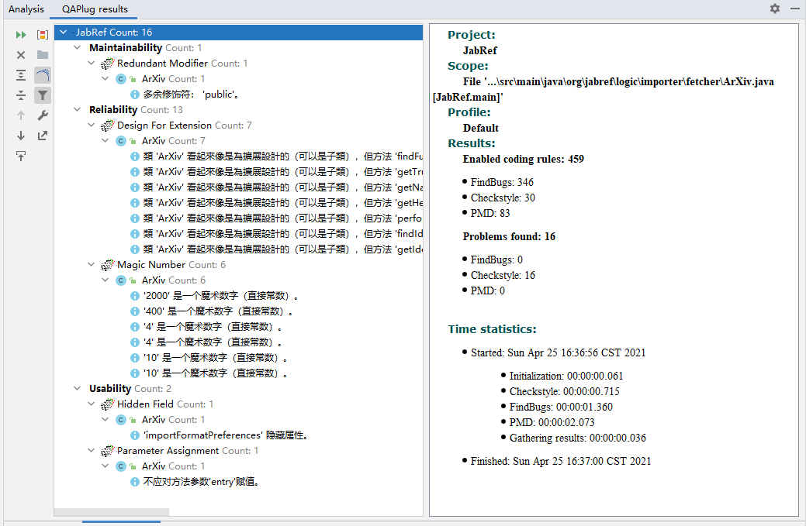
    - 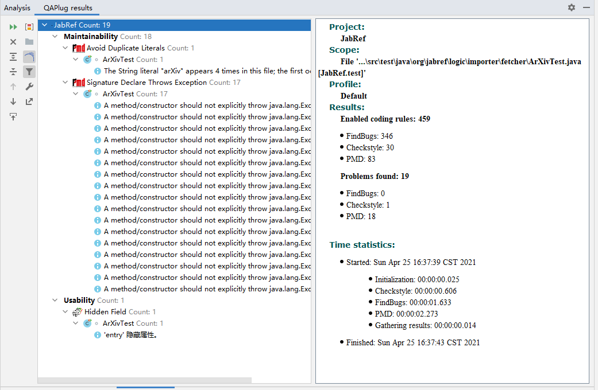
  - #7616: https://github.com/JabRef/jabref/pull/7657
    - Edit files:
      - URLDownload.java (Add method "setSSLVerification")
        - 
      - LinkedFileViewModel.java (Add method "checkSSLHandshake")
        - 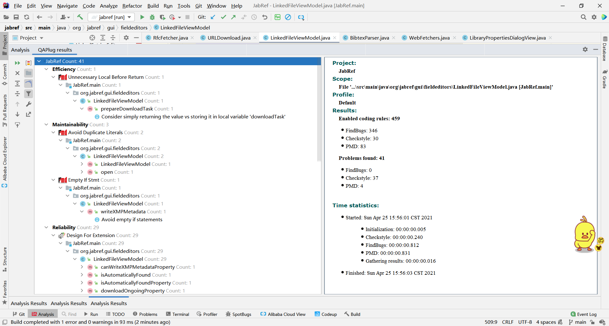
        - 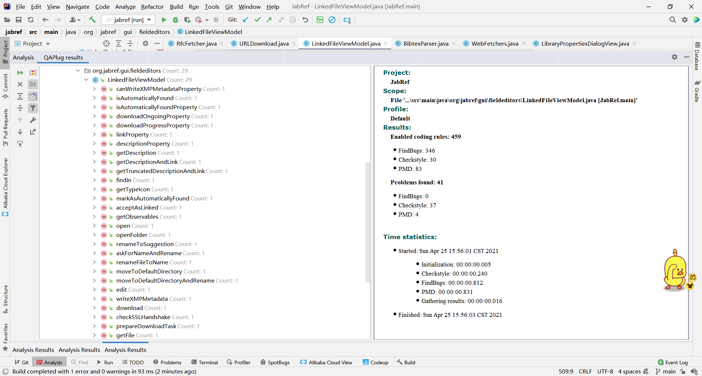
        - 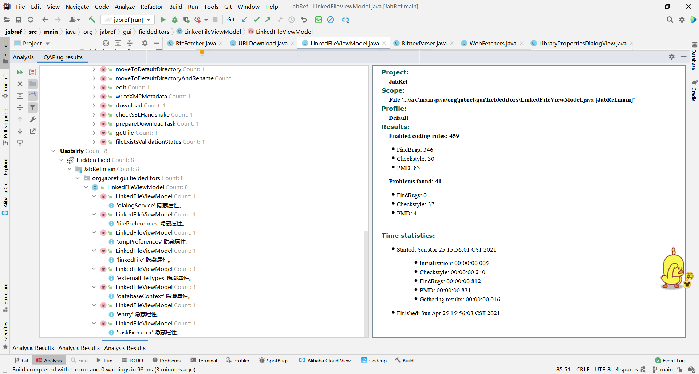
    - Before Fix
      - 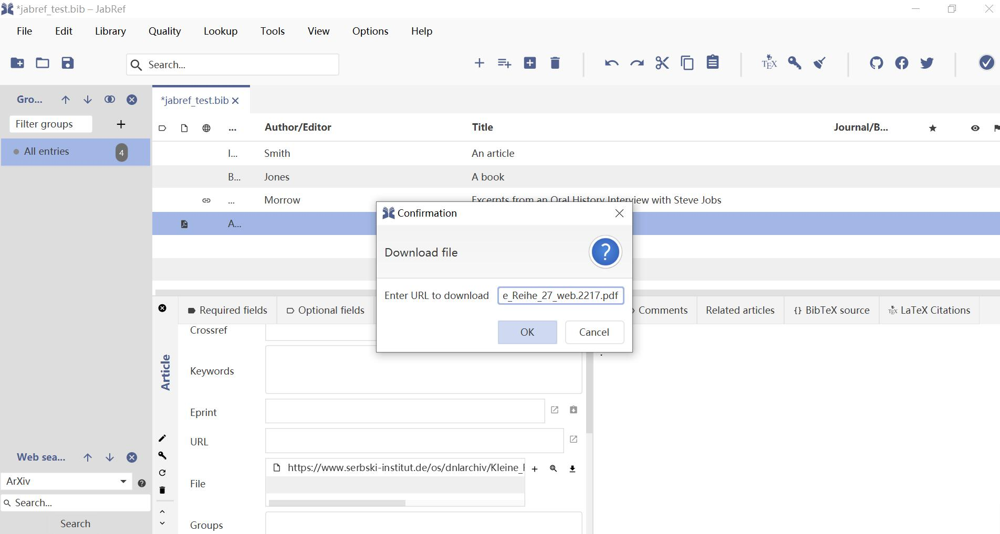
      - 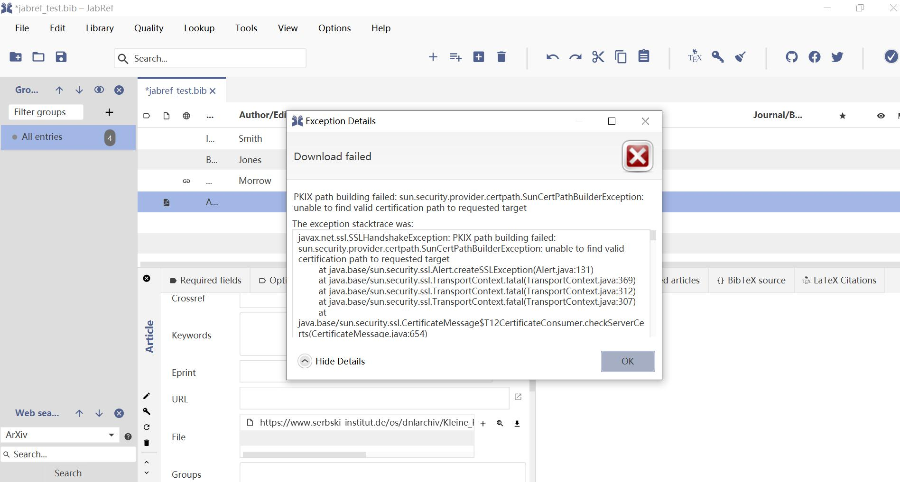
    - After Fix
      - A valid authentication path cannot be found from the site where the downloaded file is located, prompting the user with the option of whether to continue the download.
        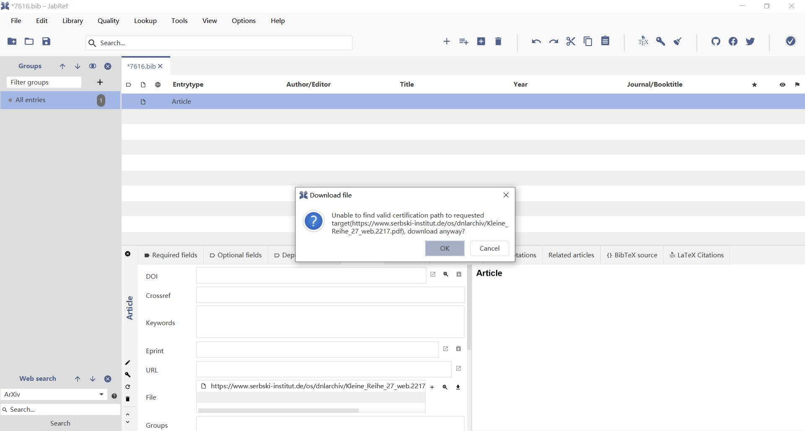
      - The user chooses to cancel the download.
        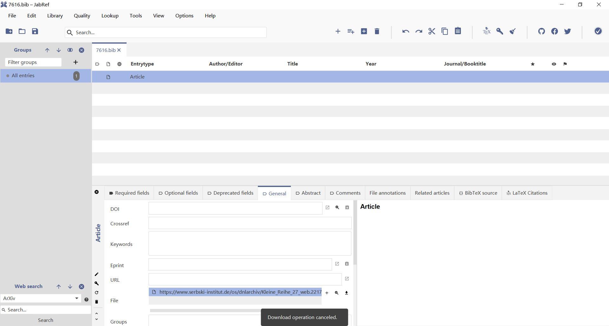
      - The user chooses to download anyway.
        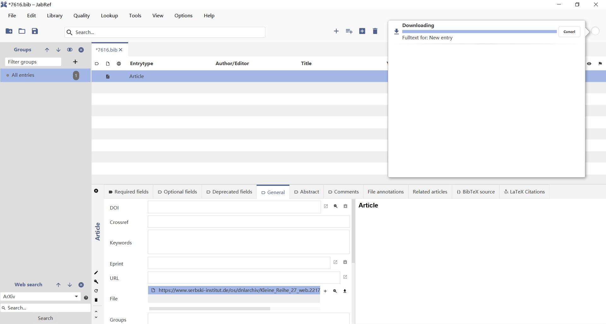
- d) Run Checkstyle, FindBugs, and PMD for all the submitted code.
  - Issue 7195 - PR 7655
    - 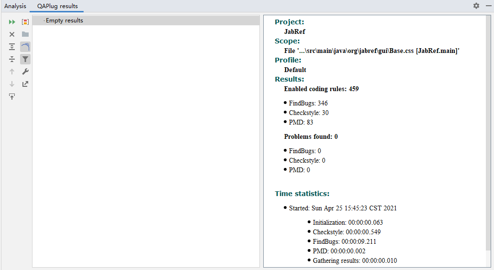
  - Issue 7016 - PR 7656
    - 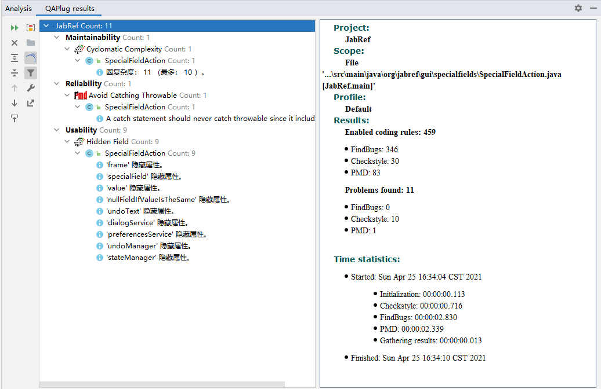
  - Issue 7382 - PR 7396
    - 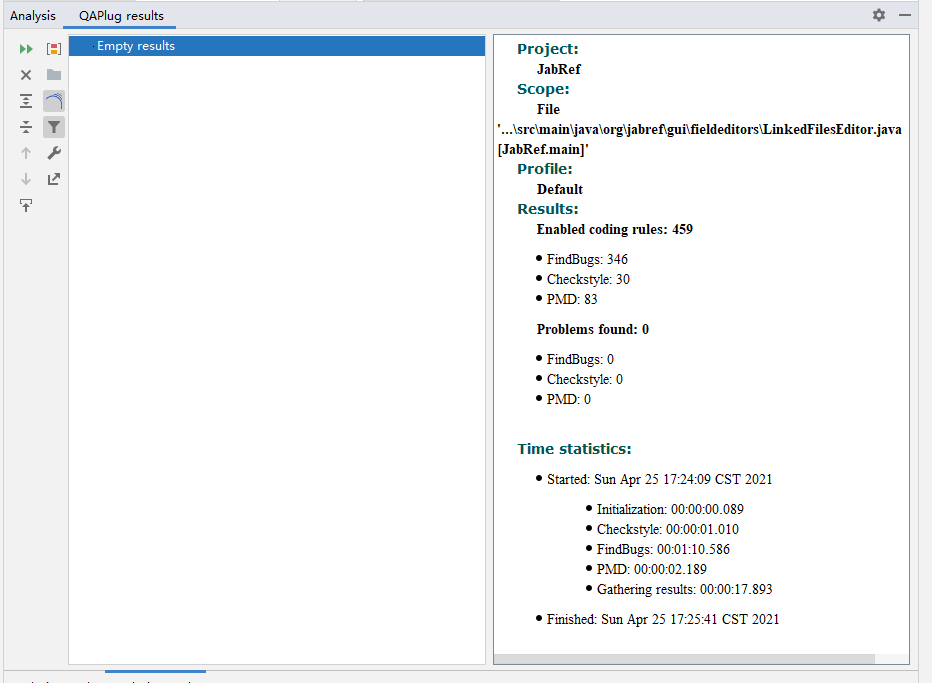
  - Issue 7381 - PR 7397
    - 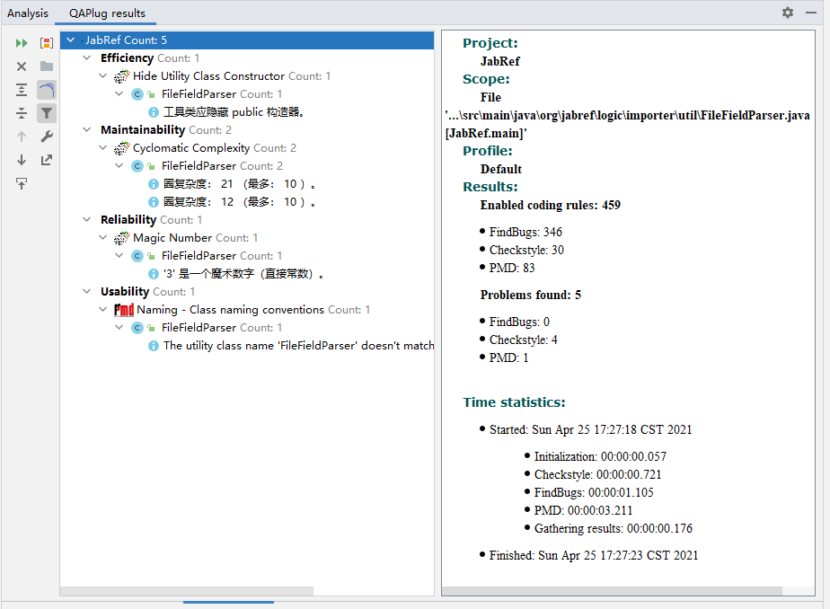
    - 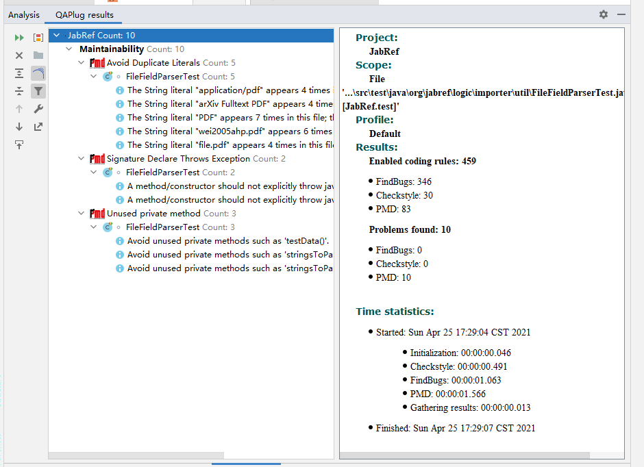
  - Issue 6994 - PR 7379
    - 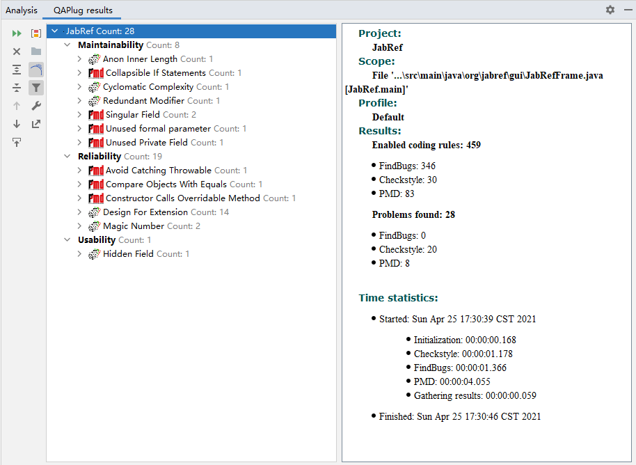
- e) Write meaningful Javadoc comments for each public method.
  - See the source code.
- f) Write >=2 JUnit tests for each modified/newly added public method for your implementation for GitHub issues.
  - See the test cases. There is only one issue (#7660) which can be tested with JUnit tests. Other issues are all related to GUI and cannot be tested with JUnit tests because the GUI is implemented by JavaFX and we have no tool to test it.
- g) Include a schedule for each week after May 1 to plan for your remaining issues.
  |Week|To Do|
  |:-:|:-:|
  |Week 12|Fix two issues and write JavaDoc|
  |Week 13|Fix two issues and write test cases|
  |Week 14|Fix tow issues and write final report|
- h) Which lab session will you attend for the Code Review?
  |Selected Project Name|Selected Project Repo|Selected Slot|
  |:-:|:-:|:-:|
  |JabRef|https://github.com/JabRef/jabref|Lab Session 5|